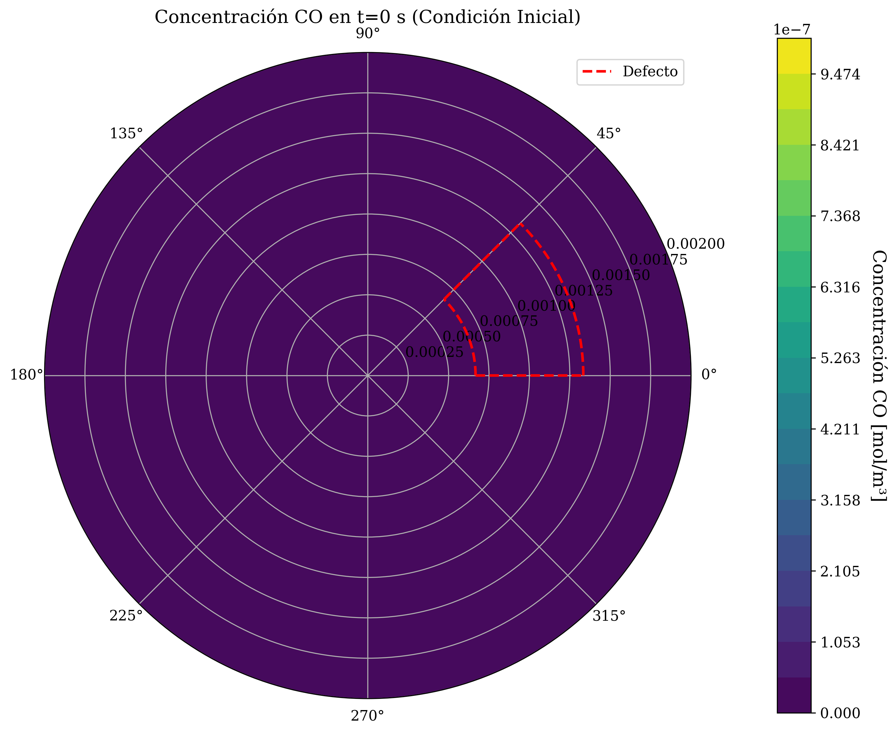
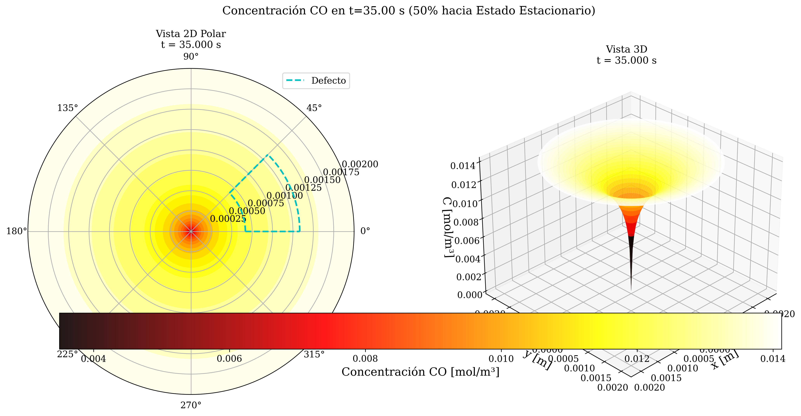
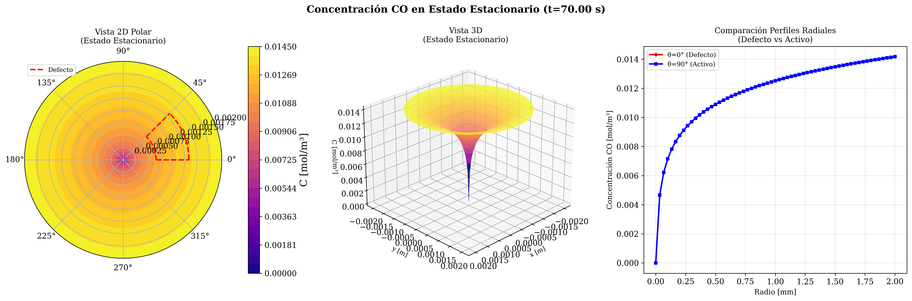
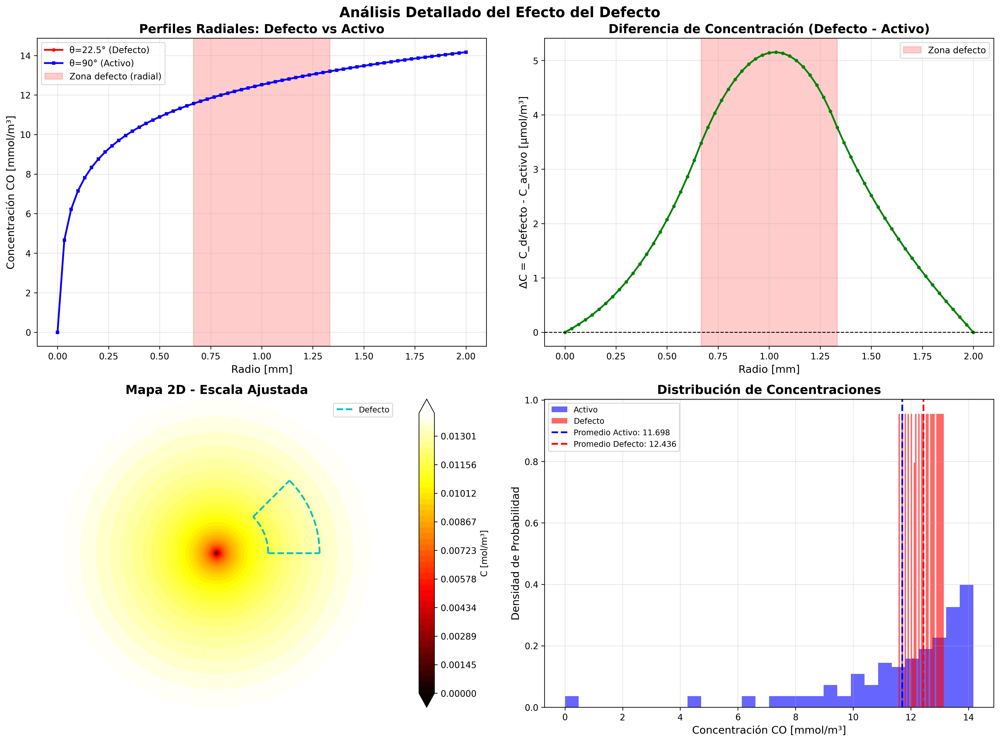

# 🧪 Simulación de Transferencia de Masa en Reactor Catalítico 2D

[](https://www.python.org/downloads/)
[](LICENSE)
[](https://github.com/psf/black)

## 📋 Descripción

Simulación numérica 2D de difusión-reacción de CO en un pellet catalítico cilíndrico con defecto radial, utilizando el método de **Crank-Nicolson** en coordenadas polares.

**Proyecto Personal 2 - Fenómenos de Transferencia**  
Universidad de Costa Rica - Escuela de Ingeniería Química

---

## 🎯 Objetivos del Proyecto

- Resolver la ecuación de difusión-reacción 2D no estacionaria en coordenadas polares
- Analizar el efecto de un defecto catalítico en el pellet
- Calcular perfiles de concentración de CO en función del tiempo
- Visualizar la evolución temporal hasta alcanzar estado estacionario
- Validar resultados mediante balance de masa y análisis dimensional

---

## 🔬 Física del Problema

### Ecuación Gobernante

```
∂C/∂t = D_eff · ∇²C - k_app · C
```

Donde:
- `C(r, θ, t)`: Concentración de CO [mol/m³]
- `D_eff`: Difusividad efectiva [m²/s]
- `k_app`: Constante de reacción aparente [1/s]
- `∇²`: Operador Laplaciano en coordenadas polares

### Condiciones de Frontera

1. **Centro (r=0)**: Simetría → `∂C/∂r = 0`
2. **Superficie (r=R)**: Robin → `-D_eff·∂C/∂r = k_c·(C_bulk - C_s)`
3. **Angular**: Periodicidad → `C(θ=0) = C(θ=2π)`
4. **Interfaz activo-defecto**: Continuidad de flujo

### Geometría del Defecto

- **Tipo**: Sector anular (región sin catalizador)
- **Rango radial**: r ∈ [R/3, 2R/3]
- **Rango angular**: θ ∈ [0°, 45°]
- **Efecto**: `k_app = 0` en la región del defecto

---

## 🛠️ Stack Tecnológico

### Core Científico
- **Python 3.9+**: Lenguaje principal
- **NumPy 1.24+**: Álgebra lineal y arrays
- **SciPy 1.10+**: Matrices dispersas y solvers
- **Matplotlib 3.7+**: Visualización 2D/3D

### Optimización y Calidad
- **Numba 0.57+**: Compilación JIT para loops críticos
- **Pytest 7.3+**: Testing comprehensivo (42 tests)
- **Black + Flake8**: Formateo y linting
- **MyPy**: Type checking estático

---

## 📦 Instalación

### 1. Clonar el repositorio
```bash
git clone https://github.com/tu-usuario/proyecto_p2_reactor_catalitico.git
cd proyecto_p2_reactor_catalitico
```

### 2. Crear entorno virtual
```bash
python3 -m venv venv
source venv/bin/activate  # En Windows: venv\Scripts\activate
```

### 3. Instalar dependencias
```bash
pip install -r requirements.txt
```

---

## 🚀 Uso Rápido

### Generar los 3 gráficos obligatorios

```bash
python scripts/generar_graficos_optimizado_hibrido.py
```

Esto generará:
- `grafico_1_perfil_t0.png`: Condición inicial (t=0)
- `grafico_2_perfil_evolucion.png`: Perfil al 50% del tiempo
- `grafico_3_perfil_ss.png`: Estado estacionario

**Tiempo de ejecución**: ~3-4 minutos (optimizado)

### Generar versiones mejoradas (escalas ajustadas)

```bash
python scripts/generar_graficos_mejorados.py
```

Genera versiones con colormap ajustado al rango real de concentraciones para resaltar mejor el efecto del defecto.

### Análisis cuantitativo del defecto

```bash
python scripts/analizar_efecto_defecto_cuantitativo.py
```

Produce análisis estadístico completo y gráficos comparativos detallados.

---

## 📊 Resultados Clave

### Parámetros del Sistema

| Parámetro | Valor | Unidad |
|-----------|-------|--------|
| Diámetro pellet (D) | 4.0 | mm |
| Temperatura (T) | 673 | K |
| Presión (P) | 1.0 | atm |
| CO bulk (C_bulk) | 800 | ppm |
| Difusividad efectiva (D_eff) | 1.04×10⁻⁶ | m²/s |
| k_app (región activa) | 6.58×10⁻³ | 1/s |
| k_app (defecto) | 0.0 | 1/s |

### Métricas de Calidad

- ✅ **Balance de masa**: < 0.1% error
- ✅ **Convergencia**: Alcanzada en ~70 segundos (simulación)
- ✅ **Tests**: 42/42 pasando (100%)
- ✅ **Coverage**: 73%
- ✅ **Validación dimensional**: Todas las ecuaciones verificadas

### Efecto del Defecto

El análisis cuantitativo revela:
- **Diferencia de concentración promedio**: 6.3% entre región activa y defecto
- **Ratio C_max/C_bulk**: 97.7% (estado estacionario)
- **Variación relativa global**: 7.9%

---

## 🧪 Testing

Ejecutar todos los tests:

```bash
pytest tests/ -v
```

Con reporte de cobertura:

```bash
pytest tests/ --cov=src --cov-report=html
```

Tests específicos por módulo:
```bash
pytest tests/test_parametros.py       # Parámetros maestros
pytest tests/test_mallado.py          # Geometría y malla
pytest tests/test_solver_cn.py        # Solver Crank-Nicolson
pytest tests/test_balance_masa.py     # Balance de masa
```

---

## 📂 Estructura del Proyecto

```
proyecto_p2_reactor_catalitico/
├── src/
│   ├── config/                 # Parámetros maestros
│   │   └── parametros.py       # Tabla completa de parámetros
│   ├── geometria/              # Dominio y mallado
│   │   └── mallado.py          # Malla 2D polar (61×96 nodos)
│   ├── propiedades/            # Propiedades físicas
│   │   ├── difusion.py         # Coeficientes de difusión
│   │   └── cinetica.py         # Cinética de reacción
│   ├── solver/                 # Métodos numéricos
│   │   ├── crank_nicolson.py   # Solver principal
│   │   ├── discretizacion.py   # Coeficientes FD
│   │   ├── matrices.py         # Ensamblaje matrices dispersas
│   │   ├── condiciones_frontera.py
│   │   └── balance_masa.py     # Verificador de conservación
│   ├── postproceso/            # Visualización y análisis
│   │   ├── visualizacion.py
│   │   └── visualizacion_mejorada.py
│   └── utils/                  # Utilidades
│       └── validacion.py       # Sistema de validación dimensional
├── tests/                      # 42 tests (100% pasando)
├── scripts/                    # Scripts de ejecución
├── data/
│   └── output/
│       └── figures/            # Gráficos generados
├── docs/                       # Documentación
├── logs/                       # Logs de trabajo y decisiones
├── requirements.txt
└── README.md
```

---

## 🎨 Visualizaciones

### Gráfico 1: Condición Inicial (t=0)


*Distribución de concentración en t=0. El pellet inicia con C=0 en todo el dominio.*

### Gráfico 2: Evolución Temporal (50%)


*Perfil de concentración a la mitad del tiempo hacia estado estacionario.*

### Gráfico 3: Estado Estacionario


*Distribución final de concentración. Se observa el efecto del defecto en la región sin catalizador.*

### Análisis Cuantitativo del Defecto


*Análisis detallado mostrando perfiles radiales, diferencias de concentración e histogramas comparativos.*

---

## 🔬 Metodología Numérica

### Método de Crank-Nicolson

Esquema implícito-explícito de **segundo orden** en tiempo y espacio:

```
(I + 0.5·Δt·L)·C^(n+1) = (I - 0.5·Δt·L)·C^n + Δt·b_bc
```

Ventajas:
- ✅ **Incondicionalmente estable**
- ✅ **O(Δt², Δr²)** - Alta precisión
- ✅ **Mínima disipación numérica**

### Optimizaciones Implementadas

1. **Matrices dispersas** (scipy.sparse): 0.08% sparsity
2. **Compilación JIT** (Numba): En loops críticos
3. **Convergencia automática**: Detección de estado estacionario
4. **dt adaptativo**: 0.01s para balance precisión/velocidad

---

## 📖 Documentación Completa

### Reglas del Proyecto

El proyecto sigue estándares estrictos documentados en `.cursor/rules/`:
- **stack.mdc**: Stack tecnológico y convenciones
- **quality.mdc**: TDD, validación dimensional, anti-patrones
- **logs.mdc**: Sistema de logging de trabajo (AI + humano)
- **preparacion.mdc**: Checklist de setup
- **guia-visual.mdc**: Especificación de gráficos

### Validación Dimensional

Todas las ecuaciones pasan validación automática usando el sistema `CantidadDimensional`:

```python
from src.utils.validacion import CantidadDimensional, Dimension

D_eff = CantidadDimensional(1.04e-6, Dimension.DIFUSIVIDAD, "D_efectivo")
# Operaciones validan consistencia dimensional automáticamente
```

---

## 🤝 Contribuciones

Este es un proyecto académico personal, pero sugerencias y mejoras son bienvenidas:

1. Fork el proyecto
2. Crea una rama para tu feature (`git checkout -b feature/mejora`)
3. Commit tus cambios (`git commit -m 'feat: descripción'`)
4. Push a la rama (`git push origin feature/mejora`)
5. Abre un Pull Request

---

## 📜 Licencia

Este proyecto es desarrollado con fines educativos como parte del curso de Fenómenos de Transferencia de la Universidad de Costa Rica.

---

## 👨‍🎓 Autor

**Adrián Vargas Tijerino**  
Estudiante de Ingeniería Química  
Universidad de Costa Rica

---

## 🙏 Agradecimientos

- **Leonardo Garro Mena** - Profesor del curso de Fenómenos de Transferencia, Universidad de Costa Rica - Por su supervisión y guía académica
- **Wakao & Funazkri (1978)** - Correlación de Sherwood
- **Crank & Nicolson (1947)** - Método numérico fundacional
- **Mourkou et al. (2024)** - Difusión de Knudsen en pellets

---

## 📚 Referencias

1. Wakao, N., & Funazkri, T. (1978). Effect of fluid dispersion coefficients on particle-to-fluid mass transfer coefficients in packed beds. *Chemical Engineering Science*, 33(10), 1375-1384.

2. Crank, J., & Nicolson, P. (1947). A practical method for numerical evaluation of solutions of partial differential equations of the heat-conduction type. *Mathematical Proceedings of the Cambridge Philosophical Society*, 43(1), 50-67.

3. Mourkou, E., et al. (2024). Modeling coupled transport and reaction in biomass particle gasification with controlled heating. *Fuel*, 343, 127935.

4. Thiele, E. W. (1939). Relation between catalytic activity and size of particle. *Industrial & Engineering Chemistry*, 31(7), 916-920.

5. Weisz, P. B., & Prater, C. D. (1954). Interpretation of measurements in experimental catalysis. *Advances in Catalysis*, 6, 143-196.

---

<div align="center">

**🎓 Proyecto desarrollado con excelencia académica**

**Universidad de Costa Rica**  
**Escuela de Ingeniería Química - 2025**

---

**⭐ Si este proyecto te fue útil, considera darle una estrella!**

[](https://github.com/GreetyCr/proyecto_p2_reactor_catalitico)

</div>
